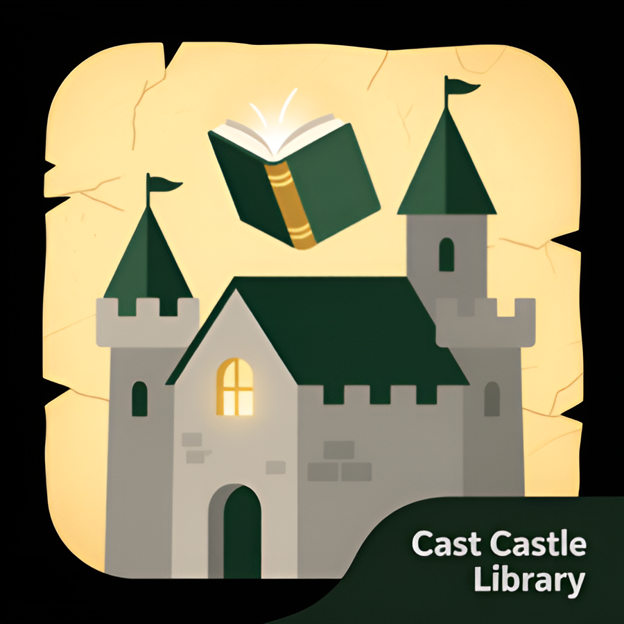

# Cast Castle [](https://github.com/vafeen/Cast-Castle/releases/latest/)

<div align="center">
  
</div>

**Cast Castle** is a lightweight Kotlin library for generating mapping code between `data class`
using **KSP (Kotlin Symbol Processing)**.  
It automatically creates mapper implementations or separate mapping functions based on the
`@CastCastleMapper` annotation.

## Implementation

[](https://github.com/vafeen/Cast-Castle/releases/latest/)

Gradle:
```kotlin
implementation("io.github.vafeen:cast-castle-annotations:VERSION")
ksp("io.github.vafeen:cast-castle-processor:VERSION")
```

Other:

https://central.sonatype.com/artifact/io.github.vafeen/cast-castle-annotations
https://central.sonatype.com/artifact/io.github.vafeen/cast-castle-processor

## Docs

[DOCUMENTATION](DOCUMENTATION.md)

[SAMPLES](SAMPLES.md)
